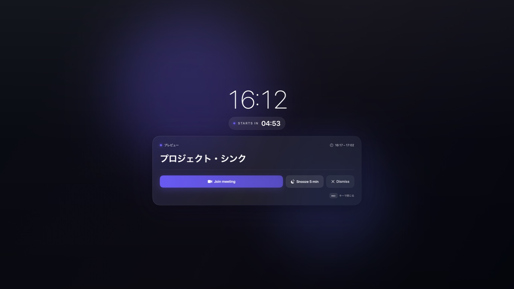

# InMyFace

標準カレンダーの予定を監視し、開始前に見逃しにくい全画面リマインダーを表示する個人用macOSアプリです。予定データはAppleのEventKitからローカルで読み取り、外部サーバーへ送信しません。



## 主な機能

- メニューバー常駐
- 通知タイミングを1〜60分前で設定
- 通知対象カレンダーを個別に選択
- 全ディスプレイ、すべてのSpace、フルスクリーンアプリ上に表示
- 会議URLを予定から検出して直接参加
- 1〜15分のスヌーズ
- Escまたは画面上のボタンで終了
- スリープ復帰、予定変更、システム時刻・タイムゾーン変更時に再計算
- ログイン時の自動起動
- Reduce Motion対応

## 動作環境

- macOS 14以降
- Xcode 15以降
- GoogleカレンダーがmacOS標準カレンダーに同期されていること

## 起動方法

1. `InMyFace.xcodeproj`をXcodeで開きます。
2. 実行先に「My Mac」を選びます。
3. Run（Command + R）を押します。
4. 初回のカレンダーアクセス確認で「許可」を選びます。
5. メニューバーのベルアイコンから「設定…」を開き、通知時刻と対象カレンダーを選びます。
6. 「通知画面をプレビュー」で実際の表示を確認します。

アプリはDockに表示されず、メニューバーに常駐します。安定運用する場合はReleaseビルドを`/Applications`へ移動してから、「ログイン時に起動」を有効にしてください。アプリを移動した後は、ログイン起動を一度オフ・オンし直します。

## ビルド

```sh
xcodebuild \
  -project InMyFace.xcodeproj \
  -scheme InMyFace \
  -configuration Release \
  -destination 'platform=macOS,arch=arm64' \
  build
```

## 通知の仕組み

今後7日間の選択済みカレンダーを読み取り、最も早い通知日時へone-shot timerを設定します。予定変更、設定変更、Macの復帰、時計・タイムゾーン変更のたびに取得と予約をやり直します。終日予定とキャンセル済み予定は通知対象外です。

Macがスリープまたはロック中はカスタム画面を表示できません。復帰時に通知予定から10分以内であれば、その場で表示します。

## プライバシー

- App Sandboxを有効化
- Calendar entitlement以外の個人情報権限は不使用
- ネットワーク通信なし
- 予定はメモリ上で処理し、予定本文をディスクへ保存しない
